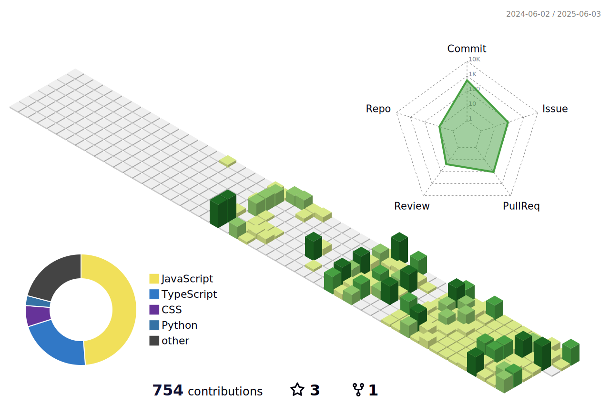

 

	<h3>📊 GitHub Contribution Graph 📊</h3>
	

 

	<h3>📚 Tech Stack 📚</h3>
	
✨ Platforms & Languages ✨

 

 

	<h3>🌍 Language Proficiency 🌍</h3>
	

		
		
	

	
Native Korean speaker, comfortable with English in daily conversations and basic technical discussions.

 

 

